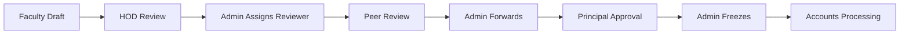
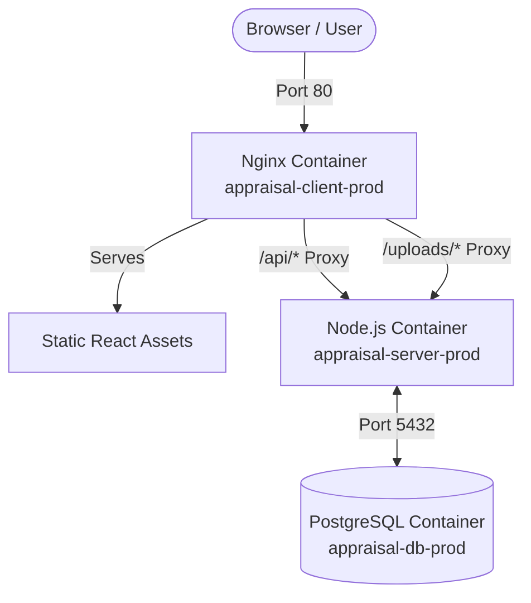

# 🎓 Ramaiah Institute of Technology - Faculty Appraisal System


An enterprise-grade, full-stack web application architected to digitize and automate the faculty performance appraisal lifecycle at **Ramaiah Institute of Technology (RIT)**. The platform orchestrates the complete appraisal pipeline—from faculty self-assessment and secure proof-document upload through a strict multi-stage peer and administrative review process, concluding with verified Accounts processing.

---

## 📖 Project Background & Motivation

Historically, annual faculty performance appraisals have relied on manual, paper-heavy workflows. Faculty members had to physically compile massive portfolios containing proof of teaching metrics, research publications, patents, and institutional service. These physical files were then manually routed through the Head of Department (HOD), an external Reviewer, the Principal, and finally the Accounts department for salary increments. This process was prone to calculation errors, physical document loss, and significant administrative delays.

**The RIT Faculty Appraisal System was developed to completely digitize this pipeline.**

### The Core Objectives
1. **Paperless Submissions:** Faculty can input all their achievements across 23 distinct academic categories (such as Q1/Q2 journal publications, patents, funded projects, and institutional service) directly into an intuitive web interface and upload PDF proofs.
2. **Automated Dynamic Scoring:** The system replaces error-prone manual calculations. The backend engine automatically calculates performance scores by applying institutionally defined rubrics, automatically adjusting weightages based on the faculty member's designation (Assistant Professor, Associate Professor, or Professor).
3. **Rigid Verification Workflow:** A strict, role-based state machine guarantees that an application cannot bypass any required level of scrutiny. It must pass through the HOD, a designated Reviewer, and the Principal before reaching the Accounts team.

---

## 🌟 Key Features

### 🔄 Multi-Stage Lifecycle Engine
The platform encodes the institution's official appraisal policies into a rigid **8-stage state machine**:

Each transition enforces strict Role-Based Access Control (RBAC), ensuring that applications can only be advanced or reverted by the legally authorized role for that specific stage.

### 🛡️ Role-Based Architecture (RBAC)
The system is divided into 6 distinct organizational roles, each featuring personalized dashboards and restricted data access matrices:
- **👨‍🏫 Faculty:** Draft self-assessments within a strictly enforced 60-day window (90 to 30 days before their joining date anniversary). Populate scoring metrics, securely upload PDF proofs, and monitor application progress.
- **🧑‍💼 HOD (Head of Department):** Evaluate departmental applications, append official comments, and issue primary recommendations or reversions.
- **🕵️ Reviewer:** External domain experts who perform secondary audits on assigned applications, with the ability to dynamically adjust awarded scores based on proof validity.
- **🏛️ Principal:** The ultimate approving authority with access to high-level departmental analytics, consolidated scoring matrices, and final decision-making power.
- **⚙️ Admin:** Master system controllers managing user provisioning, dynamic scoring configurations, reviewer assignments, overriding application windows, and complete audit trail oversight.
- **💼 Accounts:** Financial processors authorized to view frozen, approved applications to trigger salary increments and institutional accounting.

### 📊 Dynamic Scoring & Analytics Engine
A sophisticated backend calculation engine evaluates faculty inputs against institutional rubrics:
- **Comprehensive Metrics:** 23 distinct categories across 3 sections (Teaching, Research, Service). These range from FCI (Faculty Course Index) scores to PhD guidance and consulting projects.
- **Designation-Aware Logic:** Automatically scales weightages and max-caps based on whether the faculty is an Assistant Professor (e.g., higher teaching weight), Associate Professor, or Professor (e.g., higher research weight).
- **Real-time Evaluation & Admin Control:** Scores are instantly calculated and capped according to the dynamic `ScoringRules` tables in the database, strictly following the institutional rubrics defined in `FINAL_SCORING.md`. The Admin has full control to edit the JSON input configuration schemas and scoring formulas directly from the UI without requiring code deployments.

### 📄 Advanced Reporting & Document Generation
- **Official 2-Part PDF Portfolios:** Automatically compiles a high-fidelity PDF report featuring an Official Summary Form and a Detailed Annexure. Automatically injects verified digital signatures from the HOD, Reviewer, and Principal.
- **Consolidated Excel Exports:** Generates multi-sheet Excel workbooks detailing institutional and departmental summaries, empowering the Principal and Accounts teams with actionable analytics.

### 🔒 Security & Production Resilience
- **Cryptographic Authentication:** JWT-based stateless authentication with `bcrypt` password hashing.
- **Hardened Backend:** Express backend secured with `helmet` (HTTP headers), `express-rate-limit` (brute-force prevention), and `compression` (optimized payloads).
- **Immutable Audit Trail:** Every state transition and administrative action is permanently logged with IP tracking, JSON payload snapshots, and timestamping.
- **Nginx Reverse Proxy:** Production builds serve the React SPA via Nginx Alpine, seamlessly routing API calls and uploads to the secure backend container.

---

## 🛠️ Technology Stack

**Frontend Architecture:**
- **Core:** React 18, TypeScript, Vite
- **Styling:** Custom Vanilla CSS Design System with native Dark/Light mode support.
- **Routing & State:** React Router DOM, Context API.

**Backend Infrastructure:**
- **Server:** Node.js, Express.js, TypeScript
- **Database:** PostgreSQL
- **ORM:** Prisma (Type-safe database client)
- **Utilities:** `pdfkit` (Report Generation), `exceljs` (Analytics Exports), `multer` (File handling), `helmet`, `express-rate-limit`.

**DevOps & Deployment:**
- Docker & Docker Compose (Multi-stage builds, Nginx alpine, Node alpine).

---

## 🚀 Deployment Guide

### Prerequisites
- **Docker** and **Docker Compose** installed on the host machine.
- Git.

### 1. 🌍 Production Deployment (Recommended)

The production setup uses a highly optimized multi-stage Docker build. The frontend is built into static HTML/JS/CSS and served blazingly fast by **Nginx**, which also acts as a secure reverse proxy for the Node backend.

1. **Clone the Repository**
   ```bash
   git clone https://github.com/27-MANISH/appraisal-system.git
   cd appraisal-system
   ```

2. **Configure Environment Variables**
   ```bash
   cp .env.example .env
   # Open .env and set SECURE passwords, JWT secrets, and CLIENT_URL=http://your-domain.com
   ```

3. **Spin up the Production Stack**
   ```bash
   docker-compose -f docker-compose.prod.yml up -d --build
   ```
   *This single command builds the frontend via Vite, configures Nginx, installs backend production dependencies, runs Prisma migrations, seeds the database with the initial Admin account, and starts the container cluster.*

4. **Access the Application**
   - **Frontend UI:** `http://localhost:80` (or your domain/IP)
   - **Default Admin Login:** `admin@msrit.edu` / `admin123`

### 2. 💻 Local Development

For active development, hot-reloading, and manual database management.

1. **Start the Development Database & Services**
   ```bash
   docker-compose up -d db
   ```

2. **Install Local Dependencies**
   ```bash
   npm install
   cd server && npm install && cd ..
   cd client && npm install && cd ..
   ```

3. **Run the Application**
   Open two terminals:
   
   *Terminal 1 (Backend - Port 3001)*
   ```bash
   cd server
   npx prisma db push
   npm run seed
   npm run dev
   ```

   *Terminal 2 (Frontend - Port 5173)*
   ```bash
   cd client
   npm run dev
   ```

---

## 🏗️ Docker Architecture Diagram



---

*Property of Ramaiah Institute of Technology. Developed for the digital transformation of faculty appraisal pipelines.*
