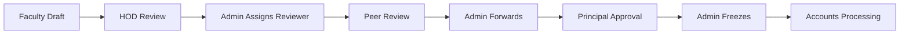

# 🎓 Ramaiah Institute of Technology - Faculty Appraisal System


An enterprise-grade, full-stack web application architected to digitize and automate the faculty performance appraisal lifecycle at **Ramaiah Institute of Technology (RIT)**. The platform orchestrates the complete appraisal pipeline—from faculty self-assessment and secure proof-document upload through a strict multi-stage peer and administrative review process, concluding with verified Accounts processing.

---

## 🌟 Key Features

### 🔄 Multi-Stage Lifecycle Engine
The platform encodes the institution's official appraisal policies into a rigid **8-stage state machine**:

Each transition enforces strict Role-Based Access Control (RBAC), ensuring that applications can only be advanced or reverted by the legally authorized role for that specific stage.

### 🛡️ Role-Based Architecture (RBAC)
The system is divided into 6 distinct organizational roles, each featuring personalized dashboards and restricted data access matrices:
- **👨‍🏫 Faculty:** Draft self-assessments, populate scoring metrics, securely upload PDF proofs, and monitor application progress.
- **🧑‍💼 HOD (Head of Department):** Evaluate departmental applications, append official comments, and issue primary recommendations or reversions.
- **🕵️ Reviewer:** External domain experts who perform secondary audits on assigned applications.
- **🏛️ Principal:** The ultimate approving authority with access to high-level departmental analytics and consolidated scoring matrices.
- **⚙️ Admin:** Master system controllers managing user provisioning, dynamic scoring configurations, reviewer assignments, and complete audit trail oversight.
- **💼 Accounts:** Financial processors authorized to view frozen, approved applications to trigger salary increments.

### 📊 Dynamic Scoring & Analytics Engine
A sophisticated backend calculation engine evaluates faculty inputs against institutional rubrics:
- **Comprehensive Metrics:** 23 distinct categories across 3 sections (Teaching, Research, Service).
- **Designation-Aware Logic:** Automatically scales weightages and max-caps based on whether the faculty is an Assistant Professor, Associate Professor, or Professor.
- **Bonus Multipliers:** Core institutional priorities automatically receive a `2x` score multiplier to incentivize high-value academic output.
- **Real-time Evaluation:** Scores are instantly calculated and capped according to the dynamic `ScoringRules` tables in the database, fully editable via the Admin Dashboard.

### 🔒 Security & Production Resilience
- **Cryptographic Authentication:** JWT-based stateless authentication with `bcrypt` password hashing.
- **Hardened Backend:** Express backend secured with `helmet` (HTTP headers), `express-rate-limit` (brute-force prevention), and `compression` (optimized payloads).
- **Immutable Audit Trail:** Every state transition and administrative action is permanently logged.
- **Nginx Reverse Proxy:** Production builds serve the React SPA via Nginx Alpine, seamlessly routing API calls and uploads to the secure backend container.

---

## 🛠️ Technology Stack

**Frontend Architecture:**
- **Core:** React 18, TypeScript, Vite
- **Styling:** Custom Vanilla CSS Design System with native Dark/Light mode support.
- **Routing & State:** React Router DOM, Context API.

**Backend Infrastructure:**
- **Server:** Node.js, Express.js, TypeScript
- **Database:** PostgreSQL
- **ORM:** Prisma (Type-safe database client)
- **Utilities:** `pdfkit` (Report Generation), `exceljs` (Analytics Exports), `multer` (File handling), `helmet`, `express-rate-limit`.

**DevOps & Deployment:**
- Docker & Docker Compose (Multi-stage builds, Nginx alpine, Node alpine).

---

## 🚀 Deployment Guide

### Prerequisites
- **Docker** and **Docker Compose** installed on the host machine.
- Git.

### 1. 🌍 Production Deployment (Recommended)

The production setup uses a highly optimized multi-stage Docker build. The frontend is built into static HTML/JS/CSS and served blazingly fast by **Nginx**, which also acts as a secure reverse proxy for the Node backend.

1. **Clone the Repository**
   ```bash
   git clone https://github.com/27-MANISH/appraisal-system.git
   cd appraisal-system
   ```

2. **Configure Environment Variables**
   ```bash
   cp .env.example .env
   # Open .env and set SECURE passwords, JWT secrets, and CLIENT_URL=http://your-domain.com
   ```

3. **Spin up the Production Stack**
   ```bash
   docker-compose -f docker-compose.prod.yml up -d --build
   ```
   *This single command builds the frontend via Vite, configures Nginx, installs backend production dependencies, runs Prisma migrations, seeds the database with the initial Admin account, and starts the container cluster.*

4. **Access the Application**
   - **Frontend UI:** `http://localhost:80` (or your domain/IP)
   - **Default Admin Login:** `admin@msrit.edu` / `admin123`

### 2. 💻 Local Development

For active development, hot-reloading, and manual database management.

1. **Start the Development Database & Services**
   ```bash
   docker-compose up -d db
   ```

2. **Install Local Dependencies**
   ```bash
   npm install
   cd server && npm install && cd ..
   cd client && npm install && cd ..
   ```

3. **Run the Application**
   Open two terminals:
   
   *Terminal 1 (Backend - Port 3001)*
   ```bash
   cd server
   npx prisma db push
   npm run seed
   npm run dev
   ```

   *Terminal 2 (Frontend - Port 5173)*
   ```bash
   cd client
   npm run dev
   ```

---

## 🏗️ Docker Architecture Diagram


---

*Property of Ramaiah Institute of Technology. Developed for the digital transformation of faculty appraisal pipelines.*
