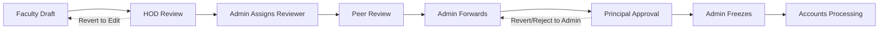

# 🎓 Ramaiah Institute of Technology - Faculty Appraisal System


An enterprise-grade, full-stack web application architected to digitize and automate the faculty performance appraisal lifecycle at **Ramaiah Institute of Technology (RIT)**. The platform orchestrates the complete appraisal pipeline—from faculty self-assessment and secure proof-document upload through a strict multi-stage peer and administrative review process, concluding with verified Accounts processing.

---

## 📂 Codebase & Project Directory Structure

```
Appraisal System/
├── DATA/                                # Legacy reference calculation rules
│   ├── cal.txt                          # 1:1 Legacy Capping & Bonus overflow algorithm
│   └── source.txt                       # Legacy appraisal system source reference
└── Software/                            # Production Web Application Base
    ├── client/                          # React + TypeScript Frontend Application
    │   ├── src/
    │   │   ├── components/              # UI Components (DataTable, ScoreCard, DynamicCategoryTable, etc.)
    │   │   │   ├── AppLayout.tsx        # Responsive Role-Gated Sidebar & Navbar Layout
    │   │   │   ├── DynamicCategoryTable.tsx # Tabular Category Entry & Dynamic Field Rendering
    │   │   │   ├── DynamicColumnEditor.tsx  # Admin Dynamic Column & Auto-Slug Mapping Tool
    │   │   │   ├── FileUpload.tsx       # Quota-Aware Drag-and-Drop Proof Uploader
    │   │   │   └── VisualJsonEditor.tsx # Interactive Formula & Config Tree Editor
    │   │   ├── context/
    │   │   │   └── AuthContext.tsx      # Global Authentication State & Session Provider
    │   │   ├── lib/
    │   │   │   ├── api.ts               # Axios Client API Service Methods
    │   │   │   └── constants.ts         # Institutional Category Column Specifications
    │   │   ├── pages/                   # Application Views
    │   │   │   ├── AnalyticsPage.tsx    # Executive Analytics, Filters & 5 Visual Chart Types
    │   │   │   ├── ApplicationsPage.tsx # Faculty Self-Assessment & Entry Form
    │   │   │   ├── AuditLogsPage.tsx    # Security Compliance Timeline & Detail Inspector
    │   │   │   ├── DashboardPage.tsx    # Role-Aware Executive Workspace & KPI Cards
    │   │   │   ├── LoginPage.tsx        # Authenticated Portal Login
    │   │   │   ├── PrincipalDashboardPage.tsx # Institutional Approval & Review Portal
    │   │   │   ├── ReviewsPage.tsx      # Peer & HOD Review Workspace
    │   │   │   └── ScoringPage.tsx      # Admin Scoring Config & System Defaults Reversion
    │   │   ├── App.tsx                  # React Router Protected DOM Map
    │   │   ├── index.css                # Enterprise Dark/Light Vanilla CSS Design System
    │   │   └── main.tsx                 # Frontend Entrypoint
    │   └── package.json
    ├── server/                          # Express.js + TypeScript Backend Application
    │   ├── prisma/
    │   │   └── schema.prisma            # PostgreSQL Database Schema & Enums
    │   ├── src/
    │   │   ├── jobs/
    │   │   │   └── appraisalReminder.js # Scheduled Cron Reminders & Email Notifications
    │   │   ├── lib/
    │   │   │   ├── email.ts             # Async Nodemailer Transport Service
    │   │   │   ├── scoreEngine.ts       # 1:1 Legacy Scoring & Bonus Overflow Engine
    │   │   │   └── upload.ts            # Magic Byte Header & Rate-Limited Upload Handler
    │   │   ├── middleware/
    │   │   │   ├── auth.ts              # JWT Token Verification & RBAC Authorization
    │   │   │   └── errorHandler.ts      # Centralized Error Formatting Handler
    │   │   ├── routes/                  # API Endpoint Routers
    │   │   │   ├── admin.ts             # Scoring Config, Defaults Revert & User Ops
    │   │   │   ├── analytics.ts         # Role-Scoped Analytics API Engine
    │   │   │   ├── applications.ts      # Application CRUD & Workflow Pipeline
    │   │   │   ├── auth.ts              # Authentication & Password Changes
    │   │   │   ├── reports.ts           # PDF & Excel Report Generator
    │   │   │   └── reviews.ts           # Peer/HOD Review & Signature Uploads
    │   │   └── index.ts                 # Express Server Initialization & Rate Limiters
    │   └── package.json
    ├── docs/                            # Remedial Documentation & Technical Specifications
    ├── docker-compose.yml               # Local Development Container Cluster
    ├── docker-compose.prod.yml          # Production Multi-Stage Nginx Container Cluster
    ├── .env                             # Environment Configuration Parameters
    └── README.md                        # Master Project Documentation
```

---

## ⚙️ Major Technical Environment Variables (`.env`)

The system exposes technical configuration options in `.env`:

| Variable Name | Default Value | Description |
| :--- | :--- | :--- |
| **`PORT`** | `3001` | Express backend server listener port |
| **`NODE_ENV`** | `development` | Runtime environment (`development`, `production`, `test`) |
| **`CLIENT_URL`** | `http://localhost:5173` | Allowed CORS origin URL for the React SPA |
| **`DATABASE_URL`** | `postgresql://...:6543/...` | PgBouncer pooled connection string for runtime queries |
| **`DIRECT_URL`** | `postgresql://...:5432/...` | Direct PostgreSQL connection string for Prisma migrations |
| **`JWT_SECRET`** | `appraisal-rit-jwt-...` | Cryptographic secret key for signing user sessions |
| **`JWT_EXPIRES_IN`** | `24h` | Validity duration of session tokens |
| **`UPLOAD_DIR`** | `./uploads` | Storage directory path for uploaded proof documents |
| **`MAX_FILE_SIZE_MB`** | `10` | Maximum size allowed per individual uploaded file in MB |
| **`UPLOAD_QUOTA_MB`** | `50` | Maximum cumulative upload quota per application in MB |
| **`MAX_FILES_PER_APP`** | `40` | Maximum number of attached proof files per application |
| **`AUTH_RATE_LIMIT_MAX`** | `100` | Max login attempts per IP window (15 minutes) |
| **`UPLOAD_RATE_LIMIT_MINS`** | `15` | Upload rate limiter evaluation window in minutes |
| **`UPLOAD_RATE_LIMIT_MAX_REQ`** | `30` | Max file upload requests allowed per IP window |
| **`ENABLE_AUTO_REMINDERS`** | `"true"` | Enable scheduled background cron reminders |
| **`SMTP_HOST`** | `smtp.gmail.com` | SMTP host server for email notifications |
| **`SMTP_PORT`** | `587` | SMTP server port |
| **`SMTP_USER`** | `admin_appraisal@...` | SMTP authentication username |
| **`SMTP_PASS`** | `[App Password]` | SMTP authentication app password |
| **`EMAIL_FROM`** | `"RIT Appraisal System" <...>` | Sender header formatted email string |

---

## 🌟 Core System Capabilities

### 🔄 Multi-Stage Lifecycle Pipeline
The platform encodes the institution's official appraisal policies into a rigid state machine:

```mermaid
graph LR
    A[Faculty Draft] --> B[HOD Review]
    B --> C[Admin Assigns Reviewer]
    C --> D[Peer Review]
    D --> E[Admin Forwards]
    E --> F[Principal Approval]
    F --> G[Admin Freezes]
    G --> H[Accounts Processing]
    B -.->|Revert to Edit| A
    F -.->|Revert/Reject to Admin| E
```

### 📊 1:1 Legacy Scoring & Overflow Algorithm (`bonusS`)
- **1:1 Legacy Alignment:** Implements the exact category calculations, section caps, and bonus overflow logic (`bonusS`) from `DATA/cal.txt`.
- **Core Cap at 100:** Total Core Score is capped at 100 (`if (totalScore > 100) totalScore = 100;`).
- **Bonus Overflow:** Surplus research scores spill over into a distinct `* Bonus Score` (`Final Score = Total Score + Bonus Score`).

### 📈 Modern Executive Analytics & 5 Interactive Chart Types
The `/analytics` dashboard provides role-scoped insights with 5 distinct visual chart engines:
1. **🍩 Proportional Donut Ring Chart:** Displays score distribution brackets (`<50`, `50-64.9`, `65-79.9`, `80-94.9`, `95-100`, `>100 Bonus`) with center metric callouts.
2. **📊 Department Performance Column Comparison:** Multi-bar vertical columns comparing Teaching, Research, Service, and Bonus averages per department.
3. **🥞 Stacked Cadre Breakdown Bar:** Proportional horizontal composition bar comparing Teaching, Research, Service, and Bonus shares per designation cadre.
4. **📉 Smooth Spline Area Trend:** Multi-year growth curves mapping Total Score vs Final Score trajectories.
5. **🎯 Target Compliance Radial Gauges:** Circular gauges comparing average achieved scores against section cap ceilings.
* **Auto-Refresh Feature:** Includes a **60-Second Auto-Refresh Timer** toggle and a **"↺ Reset Filters"** button.

### ⚙️ Scoring Configuration & Default Reversion Options
- **Dynamic Field Customization:** Admins can edit category labels, descriptions, and dynamic column schemas with automatic slug mapping (`✨ Auto Mapping Enabled`).
- **Global Revert ("↺ Revert All to Defaults"):** Single-click action to reset all 23 categories and 69 designation scoring rules back to original system defaults.
- **Per-Category / Field Revert ("↺ Default"):** Revert individual categories or sub-fields back to system defaults.

### 🔍 Security Compliance Audit Logs
- **Compact Summary Rows:** Shows ONLY essential details (Event Icon Badge, Target Entity, Actor Name/Role, Formatted Timestamp).
- **Expandable Detail Inspector:** Click any log row to inspect context metadata chips, IP tracking, and syntax-highlighted payload JSON.

---

## 🚀 Deployment Guide

### Prerequisites
- Docker & Docker Compose
- Node.js 18+ (for local CLI development)

### 1. 🌍 Production Deployment (Docker Compose)
```bash
# 1. Clone repository
git clone https://github.com/27-MANISH/appraisal-system.git
cd appraisal-system/Software

# 2. Spin up containers
docker-compose -f docker-compose.prod.yml up -d --build
```
- **Application URL:** `http://localhost:80`
- **Default Admin Account:** `admin_appraisal@msrit.edu` / `Admin@MSRIT2026`

### 2. 💻 Local Development
```bash
cd Software

# Start PostgreSQL Database
docker-compose up -d db

# Terminal 1: Backend Server (Port 3001)
cd server
npx prisma db push
npm run seed
npm run dev

# Terminal 2: Frontend App (Port 5173)
cd client
npm run dev
```

---

## 👥 Development Team & Faculty Guidance

This enterprise appraisal platform was engineered for **Ramaiah Institute of Technology** as a free institutional solution by:

### 💻 Lead Developers
* **[Manish S M](https://www.linkedin.com/in/sm-manish/)**
* **[Deepika T](https://www.linkedin.com/in/deepikaprofile/)**

### 🎓 Faculty Mentors & Guidance
* **Dr. Geetha J**
* **Dr. Sowmya B J**

---

*Property of Ramaiah Institute of Technology. Enterprise Faculty Performance Appraisal Solution.*
